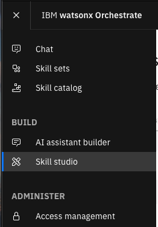

# watsonx Orchestrate에서 스킬 등록하기

이 가이드에서는 watsonx Orchestrate에서 스킬을 등록하는 과정을 안내합니다. 스킬은 오케스트레이션 흐름 내에서 특정 작업을 수행하는 재사용 가능한 구성 요소입니다.

## 전제 조건

*   watsonx Orchestrate 인스턴스
*   watsonx Orchestrate 사용자 인터페이스에 대한 이해

## 1단계: 스킬 등록 (Skill Studio)

커스텀 스킬을 등록하는 방법은 다음과 같습니다.

1.  **Skill Studio 메뉴로 이동:** watsonx Orchestrate UI에 로그인한 후, 좌측 네비게이션 바에서 "Skill Studio" 메뉴를 클릭합니다.   
    
2.  **스킬 임포트:** Skill Studio 화면에서 "Import API" 버튼을 클릭합니다.   
    
3.  **파일 선택:** "From a file" 탭을 선택합니다.    
    
4.  **스킬 파일 업로드:** "파일 선택" 버튼을 클릭하여 다운로드한 프로젝트 내 `lab01-skill and skill flow/sample-employee` 폴더에서 `sample-employee.json` 파일을 선택하고 업로드합니다.   
    
5.  **업로드 확인 및 다음 단계:** 파일이 성공적으로 업로드되었는지 확인하고 "다음" 버튼을 클릭합니다.   
    
6.  **스킬 추가:** 등록된 스킬 "employee"를 선택하고 "Add" 버튼을 클릭하여 스킬을 등록합니다.    
    

## 2단계: 스킬 커스터마이징 및 배포 (Skill Studio)

가져온 API 기반 스킬의 동작 및 입/출력을 사용자 친화적으로 조정하고 배포합니다.   

1.  **스킬 상세 설정:** 등록된 스킬의 "Enhance this skill" 버튼을 클릭합니다.     
    
2.  **API 인증 테스트:** API 키 (`employee123`)를 입력하고 "Submit" 버튼을 클릭하여 API 인증을 테스트합니다.      
    *   `api_key: employee123`
       
3.  **Phrases 수정:** 사용자가 입력할 수 있는 다양한 문구를 추가하여 스킬 호출의 유연성을 높입니다. "Phrases"는 사용자가 챗 인터페이스에 입력하는 텍스트로, 특정 스킬을 실행하는 데 사용됩니다.    
    
4.  **스킬 배포:** 모든 설정이 완료되면 "Publish" 버튼을 클릭하여 스킬을 배포합니다.   
    
5.  **배포 상태 확인:** 배포가 완료되면 스킬 상태가 "Published"로 변경되었는지 확인합니다.   
    

## 3단계: 챗 환경에서 스킬 추가 (Skill Catalog)

Legacy Chat 환경에서 스킬을 사용하려면 먼저 챗을 선택하고, Skill Catalog에서 스킬을 추가한 후, 필요한 경우 인증을 설정해야 합니다.

1.  **Chat 화면으로 이동:** watsonx Orchestrate UI에서 "Chat" 메뉴를 클릭합니다.   
    
2.  **챗 선택:** 사용할 챗 환경을 선택합니다. (예: "Personal skills")   
    
3.  **Skill Catalog 메뉴 이동:** "Skill Catalog" 메뉴를 클릭합니다.   
    
4.  **스킬 검색 및 선택:** 선택한 챗 환경 ("Personal skills")이 올바른지 확인하고, 검색창에서 등록한 스킬 ("employee")을 검색하여 해당 앱을 선택합니다.   
    
5.  **앱 연결 및 API 키 등록:** 앱 연결을 위해 "Connect app" 버튼을 클릭하고 API 키 (`employee123`)를 등록합니다.   
    
6.  **앱 연결 완료:** API 키 등록 후 "Connect app" 버튼을 클릭하여 앱 연결을 완료합니다.   
    
7.  **스킬 추가:** "Retrieve employees" 스킬을 선택하고 "Add skill" 버튼을 클릭합니다. 스킬 상태가 "Added"로 변경되었는지 확인합니다.   
    

## 4단계: 챗 환경에서 스킬 사용 (테스트)

등록된 스킬이 챗 UI에서 예상대로 작동하는지 테스트합니다.

1.  **Chat 메뉴 이동:** "Chat" 메뉴를 클릭합니다.   
    
2.  **챗 선택:** 사용할 챗 환경 ("Personal skills")을 선택합니다.   
    
3.  **스킬 호출:** 챗 입력 창에 "직원 목록을 보여줘"와 같이 Phrases에 등록된 문구를 입력합니다. 등록된 스킬이 자동으로 검색어 제안으로 나타납니다.   
    
4.  **결과 확인:** "Retrieve employees" 스킬이 실행되고 결과가 챗 인터페이스에 출력되는지 확인합니다.   
    

## 완료

축하합니다! 스킬 만들기 핸즈온 랩을 성공적으로 완료했습니다. 다음 랩으로 이동하여 watsonx Orchestrate의 더 많은 기능을 살펴보세요.