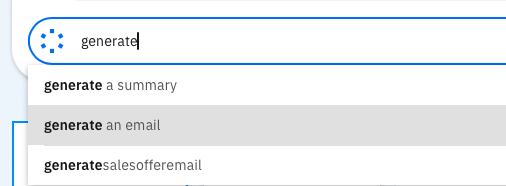

# watsonx Orchestrate Skill Builder에서 Gen AI 생성 가이드

이 가이드에서는 watsonx Orchestrate Skill Builder에서 프로젝트를 생성하고 Gen AI 스킬을 만드는 방법을 안내합니다.

## 전제 조건

*   watsonx Orchestrate 인스턴스
*   watsonx Orchestrate 사용자 인터페이스에 대한 이해

## 1단계: Skill Builder 프로젝트 생성

1.  **Skill Builder 메뉴로 이동:** watsonx Orchestrate UI에 로그인한 후, 좌측 네비게이션 바에서 "Skill Builder" 메뉴를 클릭합니다.   
    
2.  **새 프로젝트 생성:** Skill Builder 화면에서 "Create Project" 버튼을 클릭합니다.   
    
3.  **프로젝트 이름 지정:** 프로젝트 이름을 입력과 설명을 추가합니다.
    * 프로젝트 명 :  (예: "SalesOfferGeneratorProject").   
    * 프로젝트 설명 :  (예: "고객 맞춤형 세일즈 오퍼 메일 생성").    
    
5.  **프로젝트 생성:** "Create" 버튼을 클릭하여 프로젝트를 생성합니다.   
    
    

## 2단계: Gen AI 스킬 생성

1.  **프로젝트 선택:** Skill Builder 화면에서 생성한 프로젝트를 선택합니다.
    * 최초 프로젝트 생성시 : Generative AI 선택   
        
    * 프로젝트에 스킬이 있는 경우 : 프로젝트 화면내에서 "Create Skill" 버튼을 클릭합니다.   
        
2.  **스킬 이름 지정:** 스킬 이름을 입력합니다 (예: "Generate Sales Offer Email").   
    
5.  **스킬 생성:** "Create" 버튼을 클릭하여 스킬을 생성합니다.   
       


## 3단계: Gen AI 모델 설정
모델을 선택하고 프롬프트를 작성합니다. 예시를 들어 고객 이름을 입력받아 맞춤형 세일즈 오퍼 메일을 생성하는 스킬을 만들어봅니다.
1.  **모델 선택:** Gen AI 스킬 편집 화면에서 사용할 모델을 선택합니다. 이 가이드에서는 "mistralai/mixtral-8x7b-instruct-v01" 모델을 선택합니다.
2.  **프롬프트 설정:** 프롬프트 입력 필드에 다음 프롬프트를 입력합니다.
    ```
    {{name}} 고객에 대해 맞춤형 세일즈 오퍼 메일을 500자 이내로 생성해줘.
    ```
3.  **변수 생성:** 초기 topic으로 되어 있는 변수 명을 "name" 으로 변경합니다.
4.  **Max Token 설정:** "Max Token" 값을 700으로 설정합니다.
5. 결과 화면 예시   
    


## 4단계: 스킬 테스트
generate 버튼을 클릭하여 주어진 프롬프트에 대한 Gen AI 모델의 응답을 확인합니다.원하는 답변이 나오기까지 프롬프트를 수정합니다. 예제를 사용하는 기능을 제공하므로 이를 활용하면 모델 응답의 품질을 향상 시킬 수 있습니다.   


## 5단계: 접근 권한 및 공유 설정
생성한 스킬의 접근 권한(private/public) 및 공유(share)를 설정합니다.  
1. **접근 권한 설정:** private로 설정하여 개인적으로 사용하거나, public으로 설정하여 다른 사용자와 공유할 수 있습니다. 스킬을 배포하기 위해서는 ```public``` 으로 설정해야 합니다.   
    * Private(비공개)   
        * 스킬/프로젝트가 생성자(또는 소유자)와 명시적으로 공유된 사용자만 접근 가능.
        * 팀 내부 테스트나 민감한 작업에 적합.
        * 예: "HR 휴가 신청 스킬"을 팀 외부에 노출시키지 않음.
    * Public(공개) : 
        * 조직 내 모든 사용자(또는 Skill Catalog에 접근 권한이 있는 사람)가 스킬을 볼 수 있고 사용할 수 있음.
        * 범용적인 스킬 배포에 유용.
        * 예: "이메일 보내기 스킬"을 전사적으로 공유. 

    
2. **공유 권한 설정:** 스킬 편집 화면에서 "Share" 버튼을 클릭하여 스킬을 공유합니다. 스킬/프로젝트의 공유 설정을 수정하거나 협업자를 추가/제거하는 기능입니다. 팀 협업이 필요하거나, 테스트 후 공유 범위를 조정할 때 사용합니다.   
    * Private 상태에서 특정 사용자/그룹에게 접근 권한을 부여.
    * 예: "HR 팀원 A와 B에게만 휴가 신청 스킬 편집 권한 공유."
    * 권한 수준 설정 가능(예: Viewer, Editor, Admin).     

    


## 6단계: 스킬 배포

1.  **스킬 배포:** 스킬 편집 화면에서 "Publish" 버튼을 클릭합니다.   
    
2.  **배포 버전 입력:** 배포할 스킬버전을 입력합니다.
    * 배포 버전 :  (예: "1.0.0").   
    
3.  **배포 확인:** 스킬이 성공적으로 배포되었는지 확인합니다.   
    
    

## 7단계: 스킬 활용

1.  **스킬 카탈로그에서 추가:** 생성한 Gen AI 스킬을 스킬 플로우에 추가하여 자동화된 워크플로우를 구축합니다.
    * 메뉴에서 Skill Catalog를 선택합니다.
    * 생성한 스킬을 검색합니다. 이때 앱은 생성한 프로젝트 명입니다. (예: "SalesOfferGeneratorProject").   
    
    * 검색된 앱을 선택합니다.
    * 생성한 generatesalseofferemail 스킬이 보입니다. "Add skill" 버튼을 클릭하여 스킬을 추가합니다.   
    
2.  **챗 인터페이스에서 활용:** 챗 인터페이스에서 스킬을 호출하여 고객 맞춤형 세일즈 오퍼 메일을 생성합니다.
    * 메뉴에서 "Chat"을 선택합니다.
    * 사용할 챗 환경을 선택합니다. (예: "Personal skills").
    * 스킬 트리거 키워드를 입력합니다. (예: "generate.")
    
    * generatesalesofferemail 를 선택합니다. 스킬이 실행되고 결과가 챗 인터페이스에 출력되는지 확인합니다.
    
    * 고객명을 입력 후 "Apply" 버튼을 클릭하여 고객 맞춤형 세일즈 오퍼 메일을 생성합니다. 메일 내용이 출력되는지 확인합니다.
        * 결과 화면 예시    
    

## 완료

이 가이드를 통해 watsonx Orchestrate Skill Builder에서 프로젝트를 생성하고 Gen AI 스킬을 만드는 방법을 익혔습니다.
