# watsonx Orchestrate에서 스킬 플로우 만들기

이 가이드에서는 watsonx Orchestrate에서 스킬 플로우를 만드는 과정을 안내합니다. Skill Flow는 여러 개의 스킬을 순서대로 또는 조건에 따라 연결해 하나의 워크플로우를 구성하는 기능입니다. Skill Flow에 생성된 스킬은 Skill Catalog에서 특정 챗에 스킬을 추가하여 챗 환경에서 사용할 수 있습니다. 이 가이드에서는 employee 스킬에서 직원 정보를 가져와 watsonx.ai 스킬에서 Gen AI를 사용하여 이메일을 생성하는 스킬 플로우를 만들어 보겠습니다.

## 전제 조건

*   watsonx Orchestrate 인스턴스
*   watsonx Orchestrate 사용자 인터페이스에 대한 이해
*   employee 스킬 (이전 가이드에서 생성)
*   Gen AI 스킬 (고객 맞춤형 세일즈 오퍼 메일 생성) (이전 가이드에서 생성)

## 1단계: 카탈로그에서 스킬 추가
스킬 플로우에서 사용할 스킬은 사전에 Skill Catalog에 등록되어 있어야 합니다. Skill Catalog에서 스킬을 검색하고 추가합니다.

1.  **Chat 화면으로 이동:** watsonx Orchestrate UI에서 "Chat" 메뉴를 클릭합니다.   
    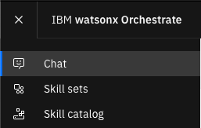
2.  **챗 선택:** 사용할 챗 환경을 선택합니다. (예: "Personal skills")   
    
3.  **Skill Catalog 메뉴 이동:** "Skill Catalog" 메뉴를 클릭합니다.   
    
4.  **스킬 검색 및 선택:** 선택한 챗 환경 ("Personal skills")이 올바른지 확인하고, 검색창에서 등록한 스킬 ("employee")을 검색하여 해당 앱을 선택합니다.   
    
5.  **앱 연결 및 API 키 등록:** 앱 연결을 위해 "Connect app" 버튼을 클릭하고 API 키 (`employee123`)를 등록합니다.   
    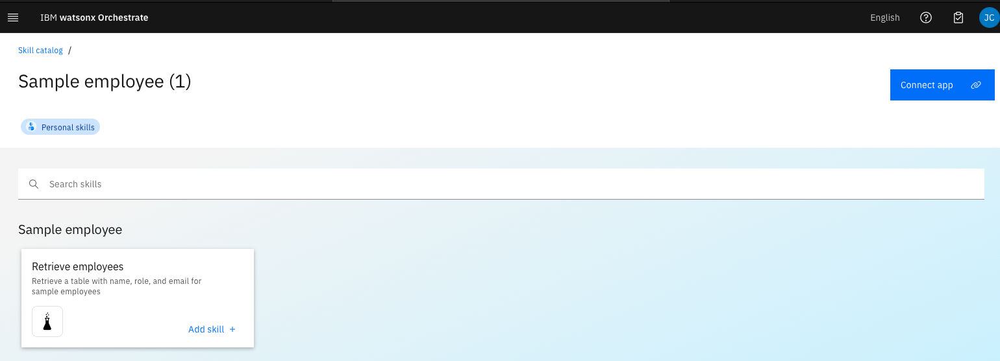
6.  **앱 연결 완료:** API 키 등록 후 "Connect app" 버튼을 클릭하여 앱 연결을 완료합니다.   
    
7.  **스킬 추가:** "Retrieve employees" 스킬을 선택하고 "Add skill" 버튼을 클릭합니다. 스킬 상태가 "Added"로 변경되었는지 확인합니다.   
    

## 2단계: 스킬 플로우 생성

1.  **Skill Studio 메뉴로 이동:** watsonx Orchestrate UI에 로그인한 후, 좌측 네비게이션 바에서 "Skill Studio" 메뉴를 클릭합니다.   
    
2.  **새 플로우 생성:** Flow Studio 화면에서 "Skill Flow" 버튼을 클릭합니다.   
    
3. **플로우 이름 편집창 이동:** 연필 모양의 에디트 버튼을 클릭하여 편집 화면으로 이동합니다.   
    
4.  **플로우 이름 지정:** 플로우 이름을 입력합니다 (예: "직원 새해 인사 이메일 생성").   
    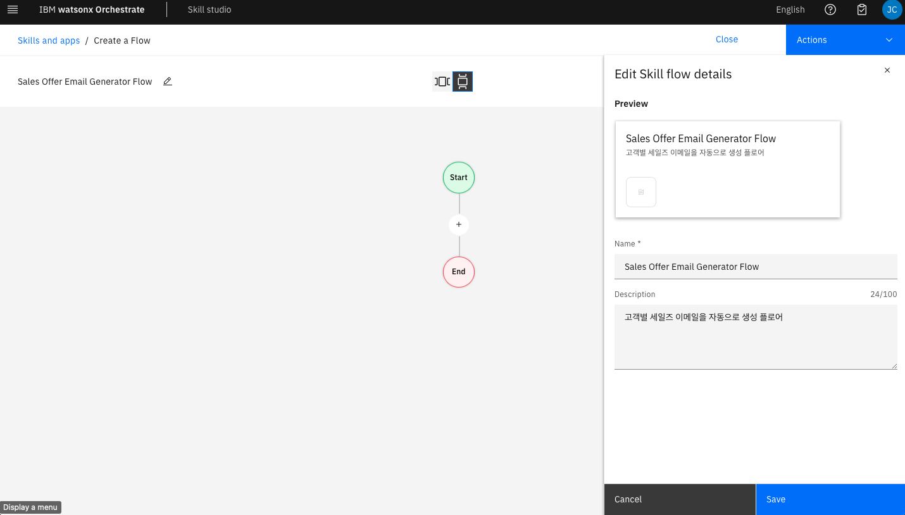
5.  **플로우 저장:** 플로우 이름을 입력한 후, "Save" 버튼을 클릭하여 플로우를 저장합니다.   
    
    

## 3단계: 스킬 추가 및 연결

1.  **employee 스킬 추가:** 플로우 편집기에서 "+" 버튼을 클릭하여 "employee" 스킬을 추가합니다.
    * 검색창에서 "employee" 스킬을 검색합니다. "Sample Employee" 스킬을 선택합니다.    
    
    * "Sample employee" 스킬을 클릭하여 상세 화면으로 이동합니다.   
    
    * "Add Skill" 버튼을 클릭하여 스킬을 플로우에 추가합니다.   
    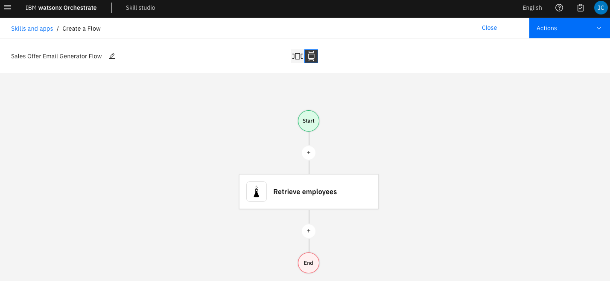
2.  **watsonx.ai 스킬 추가:** Retrieve employee 스킬 아래쪽의 "+" 버튼을 다시 클릭하고 watsonx.ai 스킬 (이메일 생성 기능)을 검색하여 플로우에 추가합니다.
    * 검색창에서 "watsonx.ai" 스킬을 검색합니다. "watsonx.ai" 스킬을 선택합니다.    
    
    * "watsonx.ai" 스킬을 클릭하여 상세 화면으로 이동합니다.   
    
    * "Add Skill" 버튼을 클릭하여 스킬을 플로우에 추가합니다.   
    

## 4단계: 스킬 플로우 구성
스킬의 input과 output을 설정하고, 스킬 간의 데이터 흐름을 구성합니다.
1.  **employee 스킬 구성:** "Retrieve employee" 스킬을 클릭하고 필요한 입력 매개변수를 설정합니다 (예: 직원 ID).
    * "Retrieve employee" 스킬을 클릭하여 상세 화면으로 이동합니다.    
    
    * "Continue on error" 버튼을 클릭하여 스킬에서 에러가 나도 다음 스킬로 진행할 수 있도록 설정합니다.
    
2.  **watsonx.ai 스킬 구성:** "watsonx.ai" 스킬을 클릭하고 이메일 생성에 필요한 입력 매개변수를 설정합니다. employee 스킬의 출력 값을 watsonx.ai 스킬의 입력 값으로 매핑합니다 (예: 직원 이름, 이메일 주소).
    * "watsonx.ai" 스킬을 클릭하여 상세 화면으로 이동합니다.   
    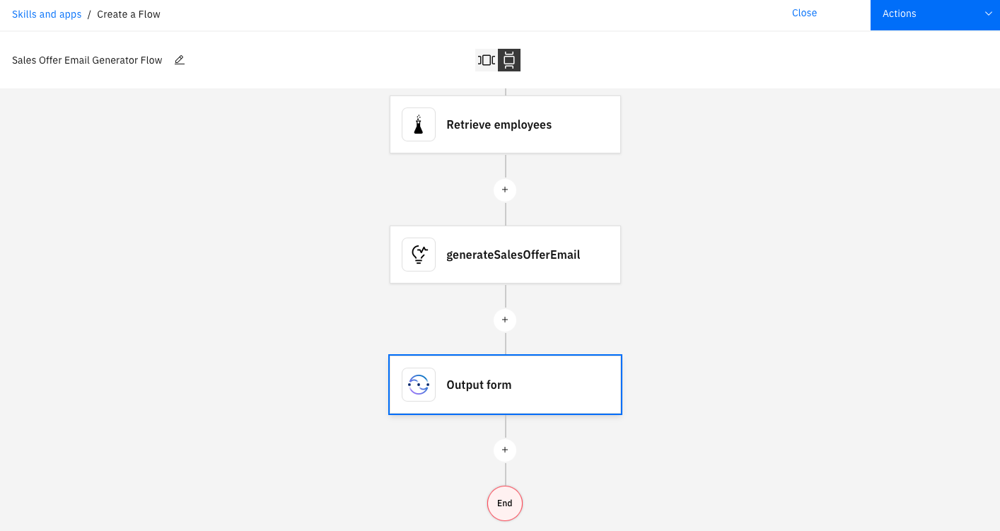
    * "Input instruction" 창을 클릭하여 employee 스킬의 출력 값을 watsonx.ai 스킬의 입력 값으로 매핑합니다.
    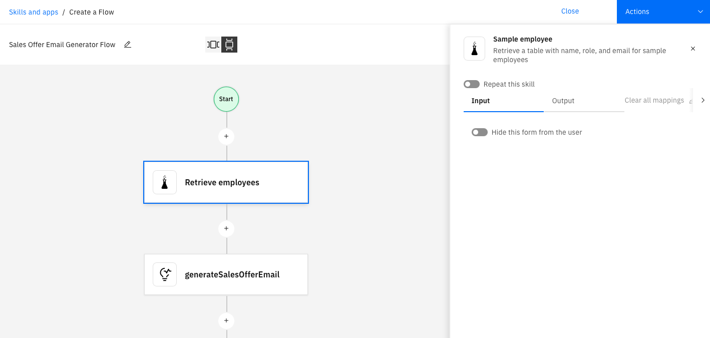
    * "이름 추가" Skills/Retrieve employees 텍스트를 클릭하면 출력 파라미터가 나타납니다. fname 항목을 선택합니다.   
    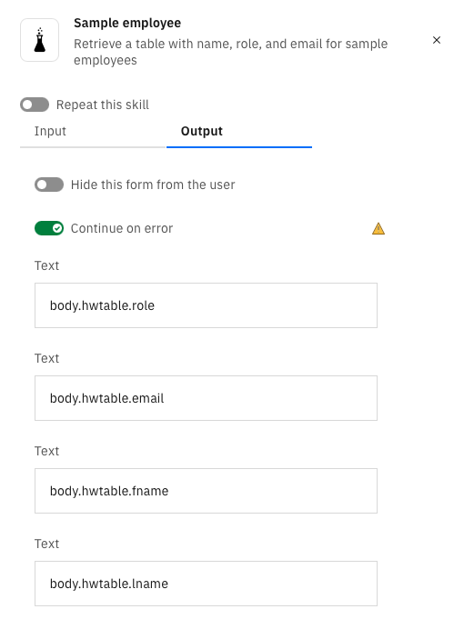 
    * "파라미터 추가하기" Input Instruction 텍스트창 옆에 "Insert variables" 아이콘을 클릭하여 파라미터를 추가합니다.
    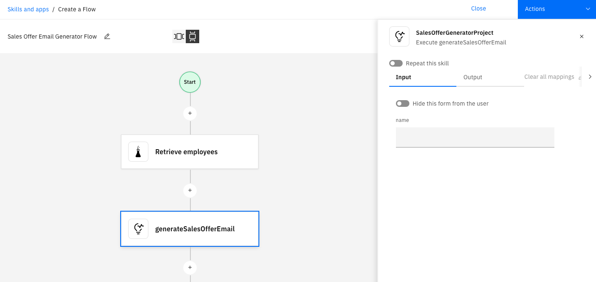
     * "성 추가" Skills/Retrieve employees 텍스트를 클릭하면 출력 파라미터가 나타납니다. lastname 항목을 선택합니다.   
        
    * "AI Instruction 작성" employee 스킬의 출력 값을 이용하여 생성형 AI에게 보낼 프롬프트를 작성합니다.
    

## 5단계: 스킬 플로우 Enhance

1.  **Enhance 실행:** 플로우 "Action" 버튼을 클릭합니다. 이후 "Enhance" 버튼을 클릭합니다.
    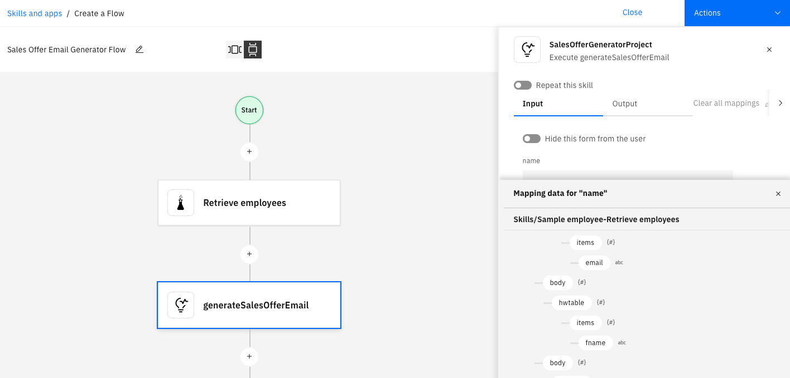
2.  **Phrase 추가:** 스킬 플로우를 호출할 수 있는 다양한 문구를 추가합니다. "Auto-generate pharses" 버튼을 클릭하여 자동으로 생성된 문구를 추가할 수도 있습니다.
    
3.  **결과 배포:** "Publish" 버튼을 클릭하여 플로우를 배포 합니다.
    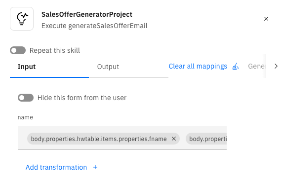

## 6단계: 카탈로그에서 스킬 플로우 추가
1. **Chat 화면으로 이동:** watsonx Orchestrate UI에서 "Chat" 메뉴를 클릭합니다.   
    
2. **챗 선택:** 사용할 챗 환경을 선택합니다. (예: "Personal skills")   
    
3. **Skill Catalog 메뉴 이동:** "Skill Catalog" 메뉴를 클릭합니다.   
    
4. **스킬 플로우 검색:** 선택한 챗 환경 ("Personal skills")이 올바른지 확인하고, 검색창에 "skill flows"를 입력한 후 실합니다. 스킬 플로오 만들어진 플로우는 이 app에 그룹화됩니다.
    
5. **생성한 스킬플로 검색:** 검색창에서 등록한 스킬 플로우 ("직원 새해 인사 이메일 생성")를 검색하여 해당 앱을 선택합니다.
    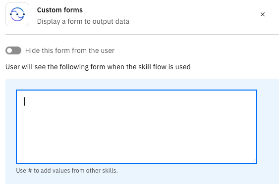

1.  **Skill Catalog 메뉴 이동:** "Skill Catalog" 메뉴를 클릭합니다.
2.  **스킬 플로우 검색 및 선택:** 선택한 챗 환경 ("Personal skills")이 올바른지 확인하고, 검색창에서 등록한 스킬 플로우 ("직원 새해 인사 이메일 생성")를 검색하여 해당 앱을 선택합니다.
3.  **앱 연결 및 API 키 등록:** 앱 연결을 위해 "Connect app" 버튼을 클릭하고 API 키 (`employee123`)를 등록합니다.
4.  **앱 연결 완료:** API 키 등록 후 "Connect app" 버튼을 클릭하여 앱 연결을 완료합니다.
5.  **스킬 추가:** "직원 새해 인사 이메일 생성" 스킬을 선택하고 "Add skill" 버튼을 클릭합니다. 스킬 상태가 "Added"로 변경되었는지 확인합니다.

## 7단계: 챗 환경에서 스킬 플로우 사용

1.  **Chat 화면으로 이동:** watsonx Orchestrate UI에서 "Chat" 메뉴를 클릭합니다.
2.  **챗 선택:** 사용할 챗 환경을 선택합니다.
3.  **스킬 플로우 호출:** 챗 입력 창에 스킬 플로우를 호출하는 문구를 입력합니다 (예: "직원 이메일 생성").
4.  **결과 확인:** 스킬 플로우가 실행되고 watsonx.ai 스킬에서 생성된 이메일 내용을 챗 인터페이스에서 확인합니다.

## 완료

watsonx Orchestrate에서 스킬 플로우를 만드는 방법을 배웠습니다. 이제 다양한 스킬을 연결하여 복잡한 작업을 자동화할 수 있습니다.
